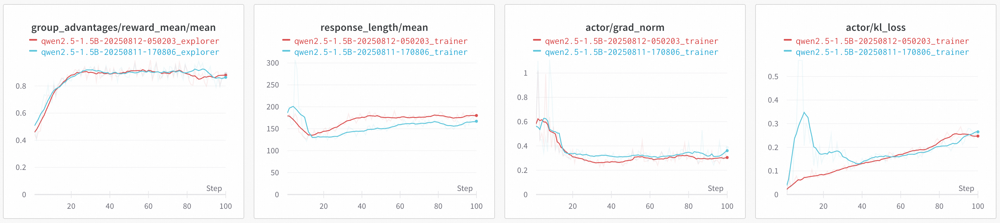
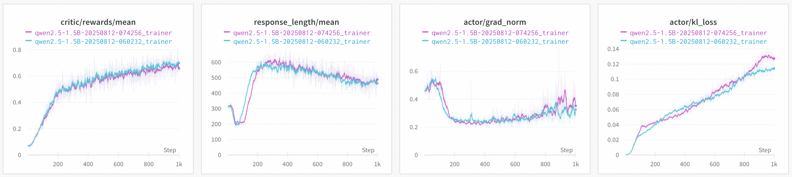

# Welcome to the Trinity Benchmark Runner 🌟

This tool makes it easy to run benchmarks for the **Trinity-RFT**. Whether you're testing training performance or inference speed, this CLI lets you configure and launch experiments quickly—no complex setup required. Just pick your dataset, hardware, and model settings, and let the tool handle the rest.

---

## 🚀 What You Can Do

- **Single or Multi-Machine Training**: Run experiments on one computer or scale across multiple nodes.
- **Auto-Config**: The tool adjusts settings based on your cluster resources and inputs.
- **Flexible Datasets**: Works with datasets like `gsm8k` and `countdown`.
- **Custom Settings**: Tweak learning rates, sync intervals, and model configurations.
- **Cloud Ready**: Supports local runs *and* cloud environments like **Aliyun PAI DLC**.

---

## 🛠️ How to Use It

### 1. Basic Command Structure
```bash
python bench.py <dataset> [options]
```

### 2. Example: Run a Benchmark
```bash
python bench.py gsm8k --node_num 1 --gpu_per_node 8 --model_path /your/model/path
```

### 3. Key Options Explained
| Option | What It Does |
|--------|--------------|
| `dataset` | Choose `gsm8k` or `countdown` |
| `--dlc` | Use when running in Aliyun PAI DLC environment |
| `--node_num` | Number of nodes in the cluster (default: 1) |
| `--gpu_per_node` | Number of GPUs per node (default: 8) |
| `--vllm_engine_num` | Number of vLLM engines to use |
| `--vllm_tp_size` | Tensor parallel size for vLLM |
| `--explorer_trainer_ratio` | Ratio of explorer engine number to trainer GPU number (default: 0.6), used when `--vllm_engine_num` is not specified |
| `--model_path` | Path to the main model checkpoint |
| `--critic_model_path` | Path to the critic model checkpoint |
| `--taskset_path` | Path to the taskset file |
| `--lr` | Learning rate for actor model |
| `--critic_lr` | Learning rate for critic model |
| `--sync_interval` | Synchronization interval between Trainer and Explorer |


---

## 📂 What Gets Saved

After running a benchmark, results are stored in `runs/<timestamp>/`:
- `config.yaml`: The exact settings used for your run.
- `checkpoints/`: Model snapshots saved during training.

---

## 📊 Benchmark Examples

### 1. GSM8K
To reproduce this experiment:
```bash
python bench.py gsm8k --model_path /path/to/Qwen/Qwen2.5-1.5B-Instruct
```
#### GSM8K Results
The chart below shows performance based on this [commit](https://github.com/modelscope/Trinity-RFT/tree/068da409d215bb2450d93b6b7a56740d4751669d).


### 2. Countdown
First generate data, then run the benchmark:
```bash
# Step 1: Generate data
python benchmark/scripts/gen-countdown-data.py --local_dir /your/data/path
# Step 2: Run benchmark
python bench.py countdown --model_path /path/to/Qwen/Qwen2.5-1.5B-Instruct --taskset_path /your/data/path
```
#### Countdown Results
The chart below shows performance based on this [commit](https://github.com/modelscope/Trinity-RFT/tree/068da409d215bb2450d93b6b7a56740d4751669d).


*More benchmarks will be added soon!*

---

## ✅ Tips for Success

1. **Pre-Download Models**: Make sure all models and tasksets are ready at the paths you specify.
2. **Multi-Node Setup**: If using multiple nodes, ensure they can communicate and share storage.
3. **vLLM Users**: Check your vLLM installation supports the features you need (like tensor parallelism).
4. **Aliyun Users**: Don’t forget the `--dlc` flag when running in PAI DLC!
