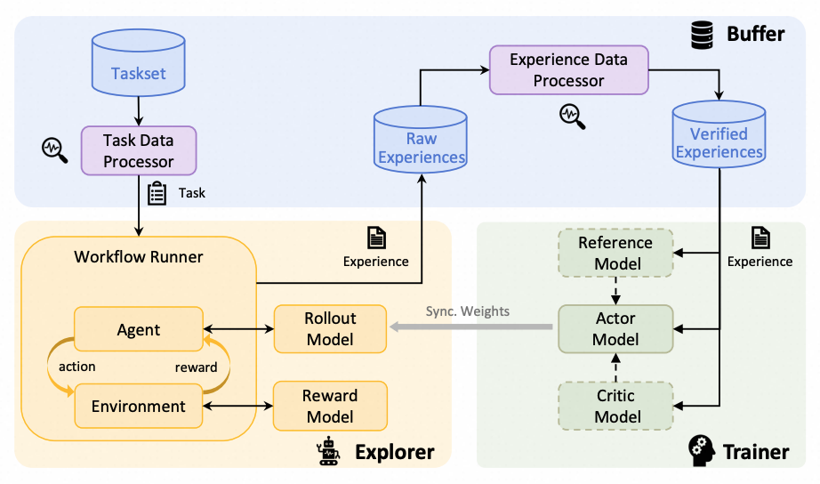
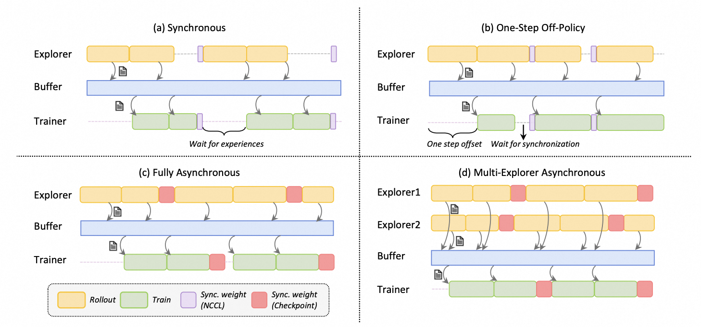
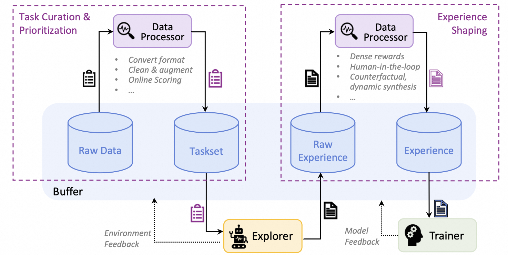
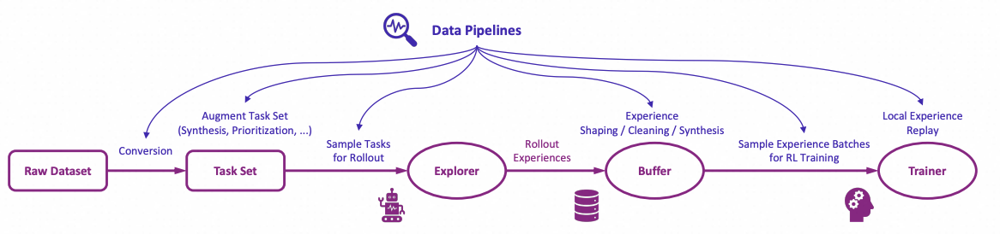
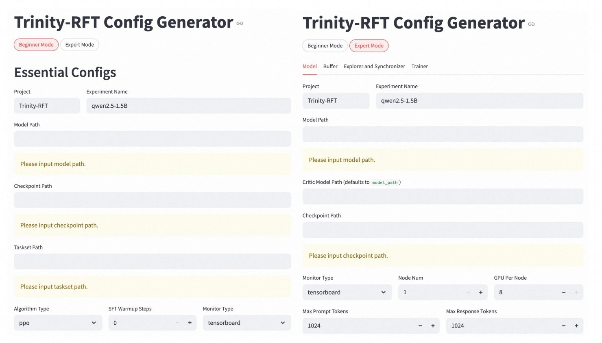

# Trinity-RFT: A General-Purpose and Unified Framework for Reinforcement Fine-Tuning of Large Language Models


## 🚀 News

* [2025-08] ✨ Trinity-RFT v0.2.1 is released with enhanced features for Agentic RL and Async RL.
* [2025-08] 🎵 We introduce [CHORD](https://github.com/modelscope/Trinity-RFT/tree/main/examples/mix_chord), a dynamic integration of SFT and RL for enhanced LLM fine-tuning ([paper](https://arxiv.org/pdf/2508.11408)).
* [2025-08] We now support training on general multi-step workflows! Please check out examples for [ALFWorld](./docs/sphinx_doc/source/tutorial/example_step_wise.md) and [ReAct](./docs/sphinx_doc/source/tutorial/example_react.md).
* [2025-07] Trinity-RFT v0.2.0 is released.
* [2025-07] We update the [technical report](https://arxiv.org/abs/2505.17826) (arXiv v2) with new features, examples, and experiments.
* [2025-06] Trinity-RFT v0.1.1 is released.
* [2025-05] We release Trinity-RFT v0.1.0 and a technical report.
* [2025-04] The initial codebase of Trinity-RFT is open.


## 💡 What is Trinity-RFT?


Trinity-RFT is a general-purpose, flexible and easy-to-use framework for reinforcement fine-tuning (RFT) of large language models (LLM).
It is designed to support diverse application scenarios and serve as a unified platform for exploring advanced RL paradigms in the [era of experience](https://storage.googleapis.com/deepmind-media/Era-of-Experience%20/The%20Era%20of%20Experience%20Paper.pdf).


## ✨ Key Features

* **Unified RFT Core:**

  Supports *synchronous/asynchronous*, *on-policy/off-policy*, and *online/offline* training. Rollout and training can run separately and scale independently on different devices.

* **First-Class Agent-Environment Interaction:**

  Handles lagged feedback, long-tailed latencies, and agent/env failures gracefully. Supports multi-turn agent-env interaction.

* **Optimized Data Pipelines:**

  Treats rollout tasks and experiences as dynamic assets, enabling active management (prioritization, cleaning, augmentation) throughout the RFT lifecycle.

* **User-Friendly Design:**

  Modular and decoupled architecture for easy adoption and development, plus rich graphical user interfaces for low-code usage.


<p align="center">
  <em>Figure: The high-level design of Trinity-RFT</em>
</p>


<details>
<summary>Figure: The architecture of RFT-core</summary>



</details>


<details>
<summary>Figure: Some RFT modes supported by Trinity-RFT</summary>



</details>


<details>
<summary>Figure: Concatenated and general multi-step workflows</summary>


</details>


<details>
<summary>Figure: The architecture of data processors</summary>



</details>


<details>
<summary>Figure: The high-level design of data pipelines in Trinity-RFT</summary>



</details>
<br>


## 🛠️ What can I use Trinity-RFT for?


* **Adaptation to New Scenarios:**

  Implement agent-environment interaction logic in a single `Workflow` or `MultiTurnWorkflow` class.  ([Example](/tutorial/example_multi_turn.md))


* **RL Algorithm Development:**

  Develop custom RL algorithms (loss design, sampling, data processing) in compact, plug-and-play classes.  ([Example](/tutorial/example_mix_algo.md))


* **Low-Code Usage:**

  Use graphical interfaces for easy monitoring and tracking of the learning process.


---

## Table of contents


- [Getting started](#getting-started)
  - [Step 1: installation](#step-1-installation)
  - [Step 2: prepare dataset and model](#step-2-prepare-dataset-and-model)
  - [Step 3: configurations](#step-3-configurations)
  - [Step 4: run the RFT process](#step-4-run-the-rft-process)
- [Further tutorials](#further-tutorials)
- [Upcoming features](#upcoming-features)
- [Contribution guide](#contribution-guide)
- [Acknowledgements](#acknowledgements)
- [Citation](#citation)


## Getting started


```{note}
Note: This project is currently under active development. Comments and suggestions are welcome!
```

### Step 1: installation


Installation from source **(recommended)**:

```shell
# Pull the source code from GitHub
git clone https://github.com/modelscope/Trinity-RFT
cd Trinity-RFT

# Create a new environment using Conda or venv
# Option 1: Conda
conda create -n trinity python=3.10
conda activate trinity

# Option 2: venv
python3.10 -m venv .venv
source .venv/bin/activate

# Install the package in editable mode
# for bash
pip install -e .[dev]
# for zsh
pip install -e .\[dev\]

# Install flash-attn after all dependencies are installed
# Note: flash-attn will take a long time to compile, please be patient.
# for bash
pip install -e .[flash_attn]
# for zsh
pip install -e .\[flash_attn\]
# Try the following command if you encounter errors during flash-attn installation
# pip install flash-attn -v --no-build-isolation
```

Installation using pip:

```shell
pip install trinity-rft==0.2.1
```

Installation from docker:
we have provided a dockerfile for Trinity-RFT (trinity)

```shell
git clone https://github.com/modelscope/Trinity-RFT
cd Trinity-RFT

# build the docker image
# Note: you can edit the dockerfile to customize the environment
# e.g., use pip mirrors or set api key
docker build -f scripts/docker/Dockerfile -t trinity-rft:latest .

# run the docker image
docker run -it --gpus all --shm-size="64g" --rm -v $PWD:/workspace -v <root_path_of_data_and_checkpoints>:/data trinity-rft:latest
```


**Requirements:**
Python version >= 3.10,
CUDA version >= 12.4,
and at least 2 GPUs.


### Step 2: prepare dataset and model


Trinity-RFT supports most datasets and models from Huggingface and ModelScope.


**Prepare the model** in the local directory `$MODEL_PATH/{model_name}`:

```bash
# Using Huggingface
huggingface-cli download {model_name} --local-dir $MODEL_PATH/{model_name}

# Using Modelscope
modelscope download {model_name} --local_dir $MODEL_PATH/{model_name}
```

For more details about model downloading, see [Huggingface](https://huggingface.co/docs/huggingface_hub/main/en/guides/cli) or  [ModelScope](https://modelscope.cn/docs/models/download).


**Prepare the dataset** in the local directory `$DATASET_PATH/{dataset_name}`:

```bash
# Using Huggingface
huggingface-cli download {dataset_name} --repo-type dataset --local-dir $DATASET_PATH/{dataset_name}

# Using Modelscope
modelscope download --dataset {dataset_name} --local_dir $DATASET_PATH/{dataset_name}
```

For more details about dataset downloading, see [Huggingface](https://huggingface.co/docs/huggingface_hub/main/en/guides/cli#download-a-dataset-or-a-space) or [ModelScope](https://modelscope.cn/docs/datasets/download).


### Step 3: configurations


Trinity-RFT provides a web interface for configuring your RFT process.

```{note}
Note: This is an experimental feature, and we will continue to improve it.
```

To enable minimal features (mainly for trainer), you can run

```bash
trinity studio --port 8080
```

Then you can configure your RFT process in the web page and generate a config file. You can save the config for later use or run it directly as described in the following section.

Advanced users can also edit the config file directly.
We provide example config files in [`examples`](examples/).

For complete GUI features, please refer to the monorepo for [Trinity-Studio](https://github.com/modelscope/Trinity-Studio).


<details>

<summary> Example: config manager GUI </summary>




</details>


### Step 4: run the RFT process


Start a ray cluster:

```shell
# On master node
ray start --head

# On worker nodes
ray start --address=<master_address>
```

(Optional) Log in to [wandb](https://docs.wandb.ai/quickstart/) for better monitoring:

```shell
export WANDB_API_KEY=<your_api_key>
wandb login
```

For command-line users, run the RFT process:

```shell
trinity run --config <config_path>
```

For example, below is the command for fine-tuning Qwen2.5-1.5B-Instruct on GSM8k with GRPO:

```shell
trinity run --config examples/grpo_gsm8k/gsm8k.yaml
```

For studio users, click "Run" in the web interface.


## Further tutorials


Tutorials for running different RFT modes:

+ [Quick example: GRPO on GSM8k](/tutorial/example_reasoning_basic.md)
+ [Off-policy RFT](/tutorial/example_reasoning_advanced.md)
+ [Fully asynchronous RFT](/tutorial/example_async_mode.md)
+ [Offline learning by DPO or SFT](/tutorial/example_dpo.md)


Tutorials for adapting Trinity-RFT to a new multi-turn agentic scenario:

+ [Concatenated Multi-turn tasks](./docs/sphinx_doc/source/tutorial/example_multi_turn.md)

Tutorials for adapting Trinity-RFT to a general multi-step agentic scenario:

+ [General Multi-Step tasks](./docs/sphinx_doc/source/tutorial/example_step_wise.md)
+ [ReAct agent tasks](./docs/sphinx_doc/source/tutorial/example_react.md)


Tutorials for data-related functionalities:

+ [Advanced data processing & human-in-the-loop](/tutorial/example_data_functionalities.md)


Tutorials for RL algorithm development/research with Trinity-RFT:

+ [RL algorithm development with Trinity-RFT](/tutorial/example_mix_algo.md)


Guidelines for full configurations: see [this document](/tutorial/trinity_configs.md)


Guidelines for developers and researchers:

+ {ref}`Build new RL scenarios <Workflows>`
+ {ref}`Implement new RL algorithms <Algorithms>`


For some frequently asked questions, see [FAQ](/tutorial/faq.md).


## Upcoming features

A tentative roadmap: [#51](https://github.com/modelscope/Trinity-RFT/issues/51)


## Contribution guide


This project is currently under active development, and we welcome contributions from the community!


Code style check:

```shell
pre-commit run --all-files
```


Unit tests:

```shell
python -m pytest tests
```


## Acknowledgements


This project is built upon many excellent open-source projects, including:

+ [verl](https://github.com/volcengine/verl) and [PyTorch's FSDP](https://pytorch.org/docs/stable/fsdp.html) for LLM training;
+ [vLLM](https://github.com/vllm-project/vllm) for LLM inference;
+ [Data-Juicer](https://github.com/modelscope/data-juicer?tab=readme-ov-file) for data processing pipelines;
+ [AgentScope](https://github.com/modelscope/agentscope) for agentic workflow;
+ [Ray](https://github.com/ray-project/ray) for distributed systems;
+ we have also drawn inspirations from RL frameworks like [OpenRLHF](https://github.com/OpenRLHF/OpenRLHF), [TRL](https://github.com/huggingface/trl) and [ChatLearn](https://github.com/alibaba/ChatLearn);
+ ......

## Citation


```
@misc{trinity-rft,
      title={Trinity-RFT: A General-Purpose and Unified Framework for Reinforcement Fine-Tuning of Large Language Models},
      author={Xuchen Pan and Yanxi Chen and Yushuo Chen and Yuchang Sun and Daoyuan Chen and Wenhao Zhang and Yuexiang Xie and Yilun Huang and Yilei Zhang and Dawei Gao and Yaliang Li and Bolin Ding and Jingren Zhou},
      year={2025},
      eprint={2505.17826},
      archivePrefix={arXiv},
      primaryClass={cs.LG},
      url={https://arxiv.org/abs/2505.17826},
}
```
