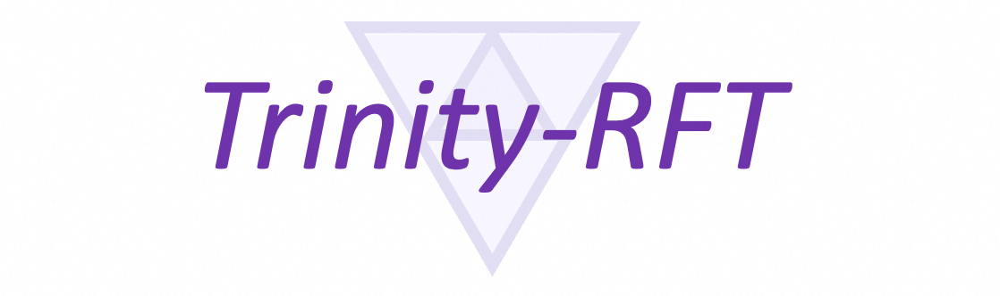
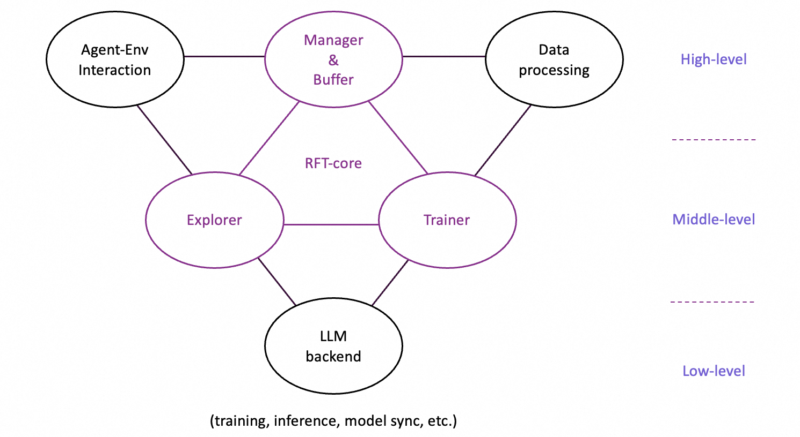

# Trinity-RFT




Trinity-RFT is a general-purpose, flexible and scalable framework designed for reinforcement fine-tuning (RFT) of large language models (LLM).
Built with a decoupled architecture, seamless integration for agentic workflows, and systematic data processing pipelines, Trinity-RFT can be easily adapted for diverse application scenarios, and serve as a platform for exploring advanced reinforcement learning (RL) paradigms.


**Vision of this project:**


Current RFT approaches, such as RLHF (Reinforcement Learning from Human Feedback) with proxy reward models or training long-CoT reasoning LLMs with rule-based rewards, are limited in their ability to handle dynamic, real-world learning.
Trinity-RFT envisions a future where AI agents learn by interacting directly with environments, collecting delayed or complex reward signals, and continuously refining their behavior through advanced RL paradigms.
For example, imagine an AI scientist that designs an experiment, executes it via interacting with the environment, waits for feedback (while working on some other tasks concurrently), and iteratively updates itself based on true environmental rewards when the experiment is finally finished.
Trinity-RFT offers a path into this future by addressing critical gaps in existing solutions.


**Key features of Trinity-RFT:**


+ **Unified RFT modes & algorithm support.**
Trinity-RFT unifies and generalizes existing RFT methodologies into a flexible and configurable framework, supporting synchronous/asynchronous and on-policy/off-policy/offline training, as well as hybrid modes that combine the above seamlessly into a single learning process (e.g., incorporating expert trajectories or high-quality SFT data to accelerate an online RL process).

+ **Agent-environment interaction as a first-class citizen.**
Trinity-RFT natively models the challenges of RFT with real-world agent-environment interactions. It allows delayed rewards in multi-step and/or time-lagged feedback loops, handles long-tailed latencies and environment/agent failures gracefully, and supports distributed deployment where explorers (i.e., the rollout agents) and trainers (i.e., the policy model trained by RL) can operate across separate clusters or devices (e.g., explorers on edge devices, trainers in cloud clusters) and scale up independently.

+ **Data processing pipelines optimized for RFT with diverse/messy data.**
These include converting raw datasets to prompt/task sets for RL, cleaning/filtering/prioritizing experiences stored in the replay buffer, synthesizing data for tasks and experiences, offering user interfaces for RFT with human in the loop, managing the task and experience buffers (e.g., supporting collection of lagged reward signals), among others.


## The design of Trinity-RFT





The overall design of Trinity-RFT exhibits a trinity:
+ RFT-core;
+ agent-environment interaction;
+ data processing pipelines tailored to RFT.


In particular, the design of RFT-core also exhibits a trinity:
+ explorer;
+ trainer;
+ manager & buffer.


The explorer, powered by the rollout model, interacts with the environment and generates rollout trajectories to be stored in the experience buffer.
The trainer, powered by the policy model, samples batches of experiences from the buffer and updates the policy via RL algorithms.
These two can be completely decoupled and act asynchronously, except that they share the same experience buffer, and their model weights are synchronized once in a while (according to a schedule specified by user configurations).


Such a decoupled design is crucial for making the aforementioned features of Trinity-RFT possible,
e.g., flexible and configurable RFT modes (on-policy/off-policy, synchronous/asynchronous, immediate/lagged rewards),
fault tolerance for failures of explorer (agent/environment) or trainer,
high efficiency in the presence of long-tailed rollout latencies,
data processing pipelines and human in the loop of RFT (e.g., via acting on the experience buffer, which is implemented as a persistent database),
among others.


Meanwhile, Trinity-RFT has done the dirty work for ensuring high efficiency in every component of the framework,
e.g., utilizing NCCL (when feasible) for model weight synchronization, sequence concatenation with proper masking for multi-turn conversations and ReAct workflows, pipeline parallelism for the synchronous RFT mode, among many others.


## Getting started


*Note: this project is currently under active development; comments and suggestions are welcome!*


### Step 1: preparations


Installation from source (recommended):

```shell
# Pull the source code from GitHub
git clone https://github.com/modelscope/Trinity-RFT
cd Trinity-RFT

# Create a new environment using Conda or venv
# Option 1: Conda
conda create -n trinity python=3.10
conda activate trinity

# Option 2: venv
python3 -m venv .venv
source .venv/bin/activate

# Install the package in editable mode
# for bash
pip install -e .[dev]
# for zsh
pip install -e .\[dev\]

# Install flash-attn after all dependencies are installed
# Note: flash-attn will take a long time to compile, please be patient.
pip install flash-attn -v
# Try the following command if you encounter errors during installation
# pip install flash-attn -v --no-build-isolation
```


Installation from docker:

We provided a dockerfile for Trinity-RFT (trinity)

```shell
git clone https://github.com/modelscope/Trinity-RFT
cd Trinity-RFT

# build the docker image
# Note: you can edit the dockerfile to customize the environment
# e.g., use pip mirrors or set api key
docker build -f scripts/docker/Dockerfile -t trinity-rft:latest .

# run the docker image
docker run -it --gpus all --shm-size="64g" --rm -v $PWD:/workspace -v <root_path_of_data_and_checkpoints>:/data trinity-rft:latest
```


### Step 2: prepare dataset and model


Trinity-RFT supports most datasets and models from Huggingface and ModelScope.


**Prepare the model** in the local directory `$MODEL_PATH/{model_name}`:

```shell
# Using Huggingface
huggingface-cli download {model_name} --local-dir $MODEL_PATH/{model_name}

# Using Modelscope
modelscope download {model_name} --local_dir $MODEL_PATH/{model_name}
```

For more details about model downloading, please refer to [Huggingface](https://huggingface.co/docs/huggingface_hub/main/en/guides/cli) or  [ModelScope](https://modelscope.cn/docs/models/download).


**Prepare the dataset** in the local directory `$DATASET_PATH/{dataset_name}`:

```shell
# Using Huggingface
huggingface-cli download {dataset_name} --repo-type dataset --local-dir $DATASET_PATH/{dataset_name}

# Using Modelscope
modelscope download --dataset {dataset_name} --local_dir $DATASET_PATH/{dataset_name}
```

For more details about dataset downloading, please refer to [Huggingface](https://huggingface.co/docs/huggingface_hub/main/en/guides/cli#download-a-dataset-or-a-space) or [ModelScope](https://modelscope.cn/docs/datasets/download).


### Step 3: configurations


You may customize the configurations in [`examples`](https://github.com/modelscope/Trinity-RFT/tree/main/examples/). For example, the model and dataset are specified as:

```yaml
model:
  model_path: $MODEL_PATH/{model_name}

data:
  dataset_path: $DATASET_PATH/{dataset_name}
```

Please refer to [`examples`](https://github.com/modelscope/Trinity-RFT/tree/main/examples/) for more details.


### Step 4: run the RFT process


First, start a ray cluster with the following command:

```shell
# On master node
ray start --head

# On worker nodes
ray start --address=<master_address>
```


Optionally, we can login into wandb to monitor the RFT process. More details of wandb can be found in its [docs](https://docs.wandb.ai/quickstart/).

```shell
export WANDB_API_KEY=<your_api_key>
wandb login
```


Then, run the RFT process with the following command:

```shell
trinity run --config <config_path>
```


For example, below is the command for fine-tuning Qwen-2.5-1.5B-Instruct on GSM8k dataset using GRPO algorithm:

```shell
trinity run --config examples/grpo_gsm8k/gsm8k.yaml
```


More example config files can be found in `examples`.


For more detailed examples about how to use Trinity-RFT, please refer to the following documents:
+ [A quick example with GSM8k](tutorial/example_reasoning_basic.md);
+ [Off-policy mode of RFT](tutorial/example_reasoning_advanced.md);
+ [Asynchronous mode of RFT](tutorial/example_async_mode.md);
+ [Multi-turn tasks](tutorial/example_multi_turn.md);
+ [Data processing pipelines](tutorial/example_data_functionalities.md);
+ [Offline learning by DPO](tutorial/example_dpo.md).


## Advanced usage and full configurations


Please refer to [this document](tutorial/trinity_configs.md).


## Programming guide for developers


Please refer to [this document](tutorial/trinity_programming_guide.md).


## Contribution guide


This project is currently under active development, and we welcome contributions from the community!


Code style check:

```shell
pre-commit run --all-files
```


Unit tests:

```shell
python -m pytest tests
```


## Acknowledgements


This project is built upon many excellent open-source projects, including:

+ [verl](https://github.com/volcengine/verl) and [PyTorch's FSDP](https://pytorch.org/docs/stable/fsdp.html) for LLM training;
+ [vLLM](https://github.com/vllm-project/vllm) for LLM inference;
+ [Data-Juicer](https://github.com/modelscope/data-juicer?tab=readme-ov-file) for data processing pipelines;
+ [AgentScope](https://github.com/modelscope/agentscope) for agentic workflow;
+ [Ray](https://github.com/ray-project/ray) for distributed systems;
+ we have also drawn inspirations from RL frameworks like [OpenRLHF](https://github.com/OpenRLHF/OpenRLHF), [TRL](https://github.com/huggingface/trl) and [ChatLearn](https://github.com/alibaba/ChatLearn);
+ ......


## Citation
```
@misc{Trinity-RFT,
  title={Trinity-RFT},
  author={{Trinity-RFT Team}},
  url={https://github.com/modelscope/trinity-rft},
  year={2025},
}
```
