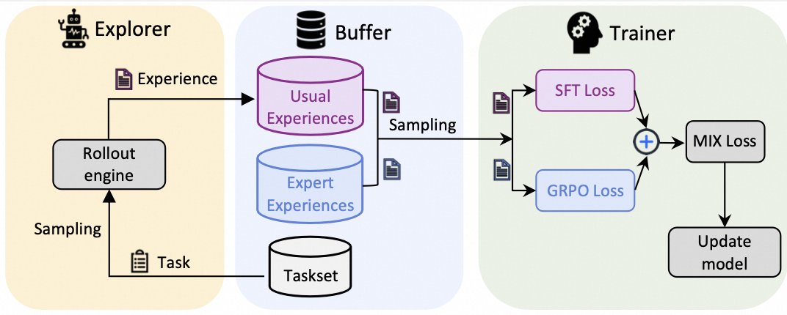

# 集成新算法

```{note}
本指南是开发者指南中 {ref}`算法模块 <Algorithms>` 部分的进阶版本。
```

本指南介绍了如何将新算法集成到 Trinity-RFT 中。
作为示例，我们引入了由更高级别的 LLM 生成的一些“专家”数据，并提出了一种名为 MIX 的算法，该算法优化以下策略目标：

$$
\mathcal{J}_{\text{Mix}}(\theta) =
(1-\mu) \mathcal{J}_{\text{GRPO}}(\theta)
+
\mu \cdot \underbrace{\frac{1}{B'} \sum_{b=1}^{B'}
\left[
    \frac{1}{T'_b} \sum_{t=1}^{T'_b}
    \log \pi_\theta(o'_{b,t} \mid q'_b, o'_{b,<t})
\right]}_{\text{Auxiliary objective on expert data}}.
$$

第一项对应标准的 GRPO 目标，旨在最大化期望奖励。最后一项是在专家数据上定义的辅助目标，鼓励策略模型（policy model）模仿专家行为。$\mu$ 是一个权重因子，用于控制两项之间的相对重要性。

此流程的可视化如下所示：



## 步骤 0：准备专家数据

我们提示一个强大的 LLM 对一些预定义问题使用 CoT（思维链）过程生成回答。收集到的数据被视为来自专家的一些 experience。我们将它们以 `jsonl` 格式存储在文件 `expert_data.jsonl` 中，格式如下：

```json
{
    "messages": [
    { "role": "system", "content": "<system_prompt>" },
    { "role": "user", "content": "What is the sum of 4 and 12?" },
    { "role": "assistant", "content": "<think>thinking process...</think>\n<answer>16</answer>" } ]
},
...
```

专家数据的路径通过 `buffer.trainer_input.auxiliary_buffers.sft_dataset` 传入，供后续使用。

## 步骤 1：定义算法

在 `trinity/algorithm/algorithm.py` 中，我们引入一个新的算法类型 `MIX`。

```python
@ALGORITHM_TYPE.register_module("mix")
class MIXAlgorithm(AlgorithmType):
    """MIX algorithm."""

    use_critic: bool = False
    use_reference: bool = True
    compute_advantage_in_trainer: bool = False
    can_balance_batch: bool = True
    schema: str = "experience"

    @classmethod
    def default_config(cls) -> Dict:
        return {
            "repeat_times": 8,
            "advantage_fn": "grpo",
            "policy_loss_fn": "mix",
            "sample_strategy": "mix",
        }
```

## 步骤 2：定义采样策略

我们需要在每一步读取两种类型的 experience 数据：普通 experience 和专家 experience。为此，我们定义了一个新的 experience 采样策略，名为 `MixSampleStrategy`。

```python
class MixSampleStrategy(SampleStrategy):
    """The default sample strategy."""

    def __init__(self, buffer_config: BufferConfig, **kwargs):
        super().__init__(buffer_config)
        self.expert_data_ratio = kwargs.get("expert_data_ratio", 0.5)
        self.sft_dataset_name = kwargs.get("sft_dataset_name", "sft_dataset")
        tot_batch_size = buffer_config.train_batch_size
        expert_batch_size = ceil(self.expert_data_ratio * tot_batch_size)

        # experience buffer
        usual_buffer_config = copy.deepcopy(buffer_config)
        usual_buffer_config.train_batch_size = tot_batch_size - expert_batch_size
        self.usual_exp_buffer = get_buffer_reader(
            buffer_config.trainer_input.experience_buffer, usual_buffer_config  # type: ignore
        )

        if buffer_config.trainer_input.auxiliary_buffers is None:
            raise ValueError(
                "`buffer_config.trainer_input.auxiliary_buffers` is required in MIX algorithm"
            )

        # expert experience buffer
        expert_buffer_config = copy.deepcopy(buffer_config)
        expert_buffer_config.train_batch_size = expert_batch_size
        self.expert_exp_buffer = get_buffer_reader(
            buffer_config.trainer_input.auxiliary_buffers[self.sft_dataset_name],
            expert_buffer_config,
        )

    async def sample(self, step: int) -> Tuple[Experiences, Dict, List]:
        metrics = {}
        with Timer(metrics, "read_time"):
            usual_exp_list = await self.usual_exp_buffer.read_async()
            for exp in usual_exp_list:
                if exp.info is None:
                    exp.info = {}
                exp.info["is_expert"] = False
                exp.info["step"] = step

            expert_exp_list = await self.expert_exp_buffer.read_async()
            for exp in expert_exp_list:
                # 设置一些 fake rewards and logprobs 以便兼容格式
                exp.reward = 0.0
                exp.logprobs = torch.zeros_like(
                    exp.tokens[exp.prompt_length :], dtype=torch.float32
                )
                exp.advantages = torch.zeros_like(
                    exp.tokens[exp.prompt_length :], dtype=torch.float32
                )
                if exp.info is None:
                    exp.info = {}
                exp.info["is_expert"] = True
                exp.info["step"] = step

            exp_list = usual_exp_list + expert_exp_list
            repr_samples = representative_sample(exp_list)

        with Timer(metrics, "gather_time"):
            exps = Experiences.gather_experiences(
                experiences=exp_list,
                pad_token_id=self.pad_token_id,  # type: ignore [arg-type]
                custom_fields=[
                    CustomField(
                        source_field="is_expert",
                        destination_field="expert_mask",
                        data_type=torch.bool,
                    ),
                    CustomField(
                        source_field="step",
                        destination_field="step",
                        data_type=torch.int32,
                    ),
                ],
            )
        return exps, metrics, repr_samples
```

这里我们使用 `Experiences.gather_experiences` 的 `custom_fields` 参数来添加一个新字段 `expert_mask`，用以标识该 experience 是否来自专家。这个字段将在策略损失函数中被用来区分普通 experience 和专家 experience。

## 步骤 3：定义策略损失函数

我们在 `trinity/algorithm/policy_loss_fn/mix_policy_loss.py` 中定义一个 `MixPolicyLoss` 类，它分别计算关于普通 experience 和专家 experience 的两个 losses 之和。

```python
@POLICY_LOSS_FN.register_module("mix")
class MIXPolicyLossFn(PolicyLossFn):
    def __init__(
        self,
        backend: str = "verl",
        mu: float = 0.1,
        clip_range: Optional[float] = None,
        clip_range_low: Optional[float] = None,
        clip_range_high: Optional[float] = None,
        use_dynamic_bsz: Optional[bool] = None,
        ppo_mini_batch_size: int = 1,
        ppo_micro_batch_size_per_gpu: int = 1,
        ngpus_trainer: int = 1,
        train_batch_size_usual: int = 1,
        train_batch_size_expert: int = 1,
        use_token_level_loss_in_sft: bool = True,
    ) -> None:
        super().__init__(backend=backend)
        self.mu = mu
        self.use_dynamic_bsz = use_dynamic_bsz
        self.experience_per_gpu = ppo_mini_batch_size // ngpus_trainer
        self.gradient_accumulation = ppo_mini_batch_size // ppo_micro_batch_size_per_gpu
        self.train_batch_size_usual = train_batch_size_usual
        self.train_batch_size_expert = train_batch_size_expert
        self.grpo_loss_fn = PPOPolicyLossFn(
            clip_range=clip_range,
            clip_range_low=clip_range_low,
            clip_range_high=clip_range_high,
        )
        self.sft_loss_fn = SFTLossFn(use_token_level_loss=use_token_level_loss_in_sft)

    def __call__(  # type: ignore
        self,
        logprob: torch.Tensor,
        old_logprob: torch.Tensor,
        action_mask: torch.Tensor,
        advantages: torch.Tensor,
        expert_mask: torch.Tensor,
        **kwargs,
    ) -> Tuple[torch.Tensor, Dict]:
        assert (
            len(expert_mask) == logprob.shape[0]
        ), f"Error: {len(expert_mask)=} != {logprob.shape[0]=}"

        n_usual_exp = torch.sum(~expert_mask).item()
        n_expert_exp = torch.sum(expert_mask).item()

        if self.use_dynamic_bsz:
            per_micro_batch_weight_usual = self.experience_per_gpu / (
                logprob.shape[0] * self.train_batch_size_usual
            )
            per_micro_batch_weight_expert = self.experience_per_gpu / (
                logprob.shape[0] * self.train_batch_size_expert
            )
        else:
            per_micro_batch_weight_usual = self.gradient_accumulation / self.train_batch_size_usual  # type: ignore
            per_micro_batch_weight_expert = self.gradient_accumulation / self.train_batch_size_expert  # type: ignore

        if n_usual_exp > 0:
            grpo_loss, grpo_metrics = self.grpo_loss_fn(
                logprob[~expert_mask],
                old_logprob[~expert_mask],
                action_mask[~expert_mask],
                advantages[~expert_mask],
                **kwargs,
            )
            grpo_loss = grpo_loss * n_usual_exp * per_micro_batch_weight_usual
            grpo_metrics = {
                k: v * n_usual_exp * per_micro_batch_weight_usual for k, v in grpo_metrics.items()
            }
        else:
            grpo_loss = torch.tensor(0.0, device=logprob.device)
            grpo_metrics = {}

        # SFT Loss (expert)
        if n_expert_exp > 0:
            sft_loss, sft_metrics = self.sft_loss_fn(
                logprob[expert_mask],
                action_mask[expert_mask],
            )
            sft_loss = sft_loss * n_expert_exp * per_micro_batch_weight_expert
            sft_metrics = {
                k: v * n_expert_exp * per_micro_batch_weight_expert for k, v in sft_metrics.items()
            }
        else:
            sft_loss = torch.tensor(0.0, device=logprob.device)
            sft_metrics = {}

        loss = (1 - self.mu) * grpo_loss + self.mu * sft_loss

        metrics = {f"usual/{k}": v for k, v in grpo_metrics.items()}
        metrics.update({f"expert/{k}": v for k, v in sft_metrics.items()})
        metrics.update({"loss": loss.item()})

        return loss, metrics

    @classmethod
    def default_args(cls) -> Dict:
        return {
            "mu": 0.1,
            "clip_range": 0.2,
        }
```

## 步骤 4：运行实验

通过上述新定义的类和函数，我们可以无需修改其他流程即可运行实验。
下面展示了一个包含关键配置的示例，包括权重因子 $\mu$（即 `algorithm.policy_loss_fn_args['mu']`）以及专家 experience 的批次大小 $B'$，其值等于 `buffer.batch_size`、`algorithm.sample_strategy_args['expert_data_ratio']` 和 `algorithm.repeat_times` 的乘积。完整配置请参考 [`mix_math.yaml`](https://github.com/modelscope/Trinity-RFT/tree/main/examples/mix_math/mix_math.yaml)。

```yaml
algorithm:
  algorithm_type: mix
  repeat_times: 8
  sample_strategy_args:
    expert_data_ratio: 0.25
  policy_loss_fn_args:
    mu: 0.1
    clip_range: 0.2
    use_token_level_loss_in_sft: False
    use_dynamic_bsz: False
    repeat_times: 8
    ppo_mini_batch_size: 256
    ppo_micro_batch_size_per_gpu: 4
    ngpus_trainer: 4
    train_batch_size_expert: 64
    train_batch_size_usual: 192
```

完成以上配置后，可通过以下命令运行实验：

```bash
trinity run --config examples/mix_math/mix_math.yaml
```
