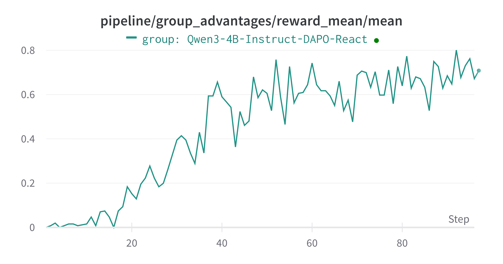

# ReAct 例子

本示例用于演示如何通过我们兼容 OpenAI 接口的 `ModelWrapper` 类，将 Trinity-RFT 训练工作流适配到你自己的智能体项目中。

这里我们以 [AgentScope](https://github.com/modelscope/agentscope) 框架为例，但你完全可以使用其他任何框架，因为 Trinity 提供了极大的灵活性。该示例利用一个采用 ReAct 风格推理并支持原生工具调用的智能体（Agent），在 GSM8K 数学数据集上对模型进行微调。

## 关键特性

此示例突出了 Trinity-RFT 框架的几项高级特性：

### 与外部智能体框架的无缝集成
Trinity-RFT 被设计为高度模块化，因此你可以轻松地将来自外部框架（如 AgentScope）的复杂、现成的智能体逻辑直接嵌入到 Trinity 的 `Workflow` 中。

- **无需重写智能体**：你不必在 Trinity 内重新实现智能体的复杂逻辑（例如 ReAct 循环、内存管理或工具调用）。
- **关注高层编排**：正如我们在 `AgentScopeReactV2MathWorkflow` 中所展示的那样，Trinity 工作流只需初始化并调用外部智能体的 `reply` 方法。Trinity 对底层复杂性负责，使你能专注于高层任务编排和奖励设计。

### 通用多步训练
现代智能体任务通常涉及多步推理、工具使用和观察。Trinity-RFT 原生支持跨这些多步交互的训练。

- **逐步步经验生成**：Trinity 不仅从最终结果进行学习，还能将智能体推理轨迹中的每一步视为独立的学习经验（experience）。
- **奖励分配**：解决任务的奖励（reward）会传播至成功轨迹内的所有 experience，使模型能够学习整个推理链，而不仅仅是最终响应。这由配置中的 `advantage_fn` 控制。

### 原生工具调用支持
Trinity-RFT 的推理引擎和训练流水线专为支持原生 OpenAI `tool_calls` 格式而构建。

- **学习使用工具**：该框架允许模型学习*何时*调用工具、*调用哪个*工具以及*使用什么*参数，全部采用标准 `tool_calls` 格式。
- **易操作性**：这种原生支持确保了与任何消费 OpenAI API 格式的服务或环境无缝集成，例如 `MCP_server`（多智能体协作平台）或其他工具使用评估器。

## 工作原理

下面我们逐步介绍如何执行此流程。

### 工作流 (`workflow.py`)

核心逻辑封装在 `AgentScopeReactV2MathWorkflow` 类中。

1.  **初始化 (`__init__`)**
    - 首先初始化 AgentScope 环境和所需的 Agent（`ReActAgentV2`）。
    - 最关键的集成步骤是将 Trinity 的模型客户端注入到 Agent 中：
      ```python
      self.openai_client = model.get_openai_client()
      # self.openai_client = get_openai_async_client() # or async client depend on whether you are using async openai client
      # ...
      self.agent.model.client = self.openai_client
      ```
      这确保了 Agent 发出的所有 API 请求都通过 Trinity 的 `ModelWrapper` 进行路由，后者会记录完整的对话历史。

2.  **执行 (`run`)**
    - `run` 方法非常简洁，它只是将任务描述传递给 Agent。
      ```python
      content = self.agent.reply(msg).content # your agent logic
      ```
    - 在 Agent 完成其多步推理并产生最终答案后，Trinity 从模型历史中提取所有中间轮次：
      ```python
      experiences = self.model.extract_experience_from_history(clear_history=True)
      ```
    - 基于最终答案计算奖励，并将其应用于从该轨迹生成的所有 `Experience` 对象。然后这些 experiences 被发送到 Buffer 中用于训练。

### 配置说明

配置文件用于微调整个系统的行为。以下是本示例的关键参数：

#### 原生工具调用设置

`explorer.rollout_model` 部分的这些设置用于配置基于 vLLM 的引擎，以生成和解析兼容 OpenAI 的工具调用。
我们使用 `Qwen3` 模型并通过 vLLM 托管模型。不同模型的配置可参考 [vLLM Toolcalls](https://docs.vllm.ai/en/stable/features/tool_calling.html#qwen-models)


```yaml
explorer:
  rollout_model:
    # ...
    enable_auto_tool_choice: true # 允许模型生成 `tool_calls`
    tool_call_parser: hermes       # 指定格式化解析工具调用输出的解析器
    reasoning_parser: deepseek_r1  # 有助于解析模型的思维过程
    enable_thinking: true          # 允许模型生成中间“思考”内容
```

#### 多步训练策略

`algorithm` 部分的此设置定义了如何处理多步 rollout 产生的 experience。

```yaml
algorithm:
  algorithm_type: grpo
  advantage_fn: step_wise_grpo # 多步训练的关键
```
-   `step_wise_grpo`：该策略告诉 Trinity 为智能体执行路径中的每一步创建独立的训练样本。`grpo` 算法随后使用这些样本来更新模型。

#### 异步同步提升效率

由于多步 rollout 会产生数量不固定的 experience，等待固定数量的 *rollout* 是低效的。我们采用动态同步策略。

```yaml
synchronizer:
  sync_style: dynamic_by_explorer # 当积累足够 experience 时即开始训练
  sync_interval: 2
```
-   `sync_style: dynamic_by_explorer`：当缓冲区收集到足够的 *experience*（即单个对话轮次）时，trainer 即启动一次训练任务，而不是等待固定数量的完整智能体轨迹。这显著提高了 GPU 利用率和训练吞吐量。

## 如何运行示例

1.  **前置条件**：确保已安装 Trinity 及本示例所需依赖（如 `AgentScope`）。请参考 [Agentscope Github link](https://github.com/agentscope-ai/agentscope/tree/v0)

> **注意**：本示例需要以下来源之一的 AgentScope：
>  - Commit: `ad13ed5dacecb79d20abf626769f8c7d7a7d2afb`
>  - 分支: [`v0`](https://github.com/agentscope-ai/agentscope/tree/v0)

2. 下载你想使用的模型，并填写 `examples/agentscope_tool_react/agentscopev0_tool_react_gsm8k.yaml` 或 `examples/agentscope_tool_react/agentscopev0_tool_react_dapo.yaml` 中的配置文件

3.  **启动训练任务**：从仓库根目录运行以下命令。

    ```bash
    trinity run --config examples/agentscope_tool_react/agentscopev0_tool_react_gsm8k.yaml
    ```

    或

    ```bash
    trinity run --config examples/agentscope_tool_react/agentscopev0_tool_react_dapo.yaml
    ```


GSM8K 数据集的示例非常简单，在 8 块 H20 GPU 上几分钟内即可收敛。


DAPO 数据集的示例耗时稍长，但也能够收敛。


我们还可以看到，模型总体上开始更多地使用工具调用来解决问题。


我们也可以把使用 v1 版本的 AgentScope 仓库，然后对 Qwen3-4b-instrcut-2507 进行训练：




## 总结

这个示例虽然简单，但展示了 Trinity 在训练使用工具的复杂多步智能体方面的强大功能和灵活性。通过无缝集成外部智能体逻辑，并提供对多步训练和工具调用的原生支持，Trinity-RFT 使你能够高效地在复杂且真实的任务上微调模型。
