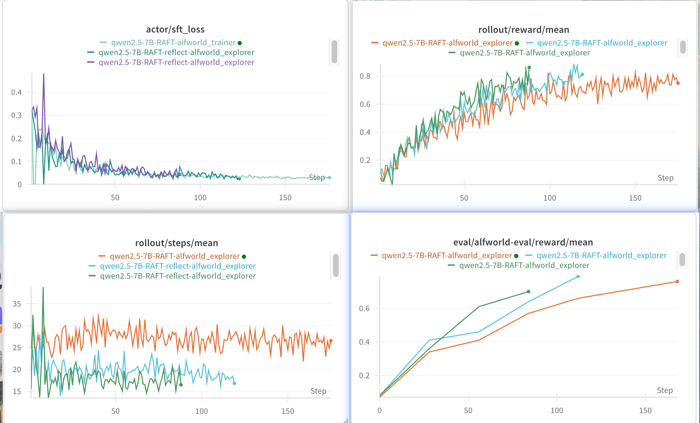

# RAFT on ALFWorld Dataset

This example shows the usage of RAFT on the ALFWorld dataset, with both standard and reflection-enhanced variants.



## Variants

### Standard RAFT
The config files are located in [`RAFT_alfworld_7B.yaml`](RAFT_alfworld_7B.yaml) and [`train_alfworld.yaml`](train_alfworld.yaml).

### RAFT with Reflection
The config files are located in [`RAFT_reflect_alfworld_7B.yaml`](RAFT_reflect_alfworld_7B.yaml) and [`train_alfworld.yaml`](train_alfworld.yaml).

## Setup

### Data Preparation
To prepare the ALFWorld dataset, run:
```bash
python examples/grpo_alfworld/get_alfworld_data.py
```

### Configuration
Before running, make sure to update the following paths in the YAML files:
- `model.model_path`: Replace with your model path (e.g., `/PATH/TO/MODEL/`)
- `buffer.explorer_input.taskset.path`: Replace with your alfworld dataset path
- `buffer.explorer_input.eval_tasksets[0].path`: Replace with your alfworld dataset path
- `checkpoint_root_dir`: Replace with your desired checkpoint directory

## Implementation
The workflow implementations are located in:
- Standard RAFT: [`trinity/common/workflows/envs/alfworld/RAFT_alfworld_workflow.py`](../../trinity/common/workflows/envs/alfworld/RAFT_alfworld_workflow.py)
- RAFT with Reflection: [`trinity/common/workflows/envs/alfworld/RAFT_reflect_alfworld_workflow.py`](../../trinity/common/workflows/envs/alfworld/RAFT_reflect_alfworld_workflow.py)
