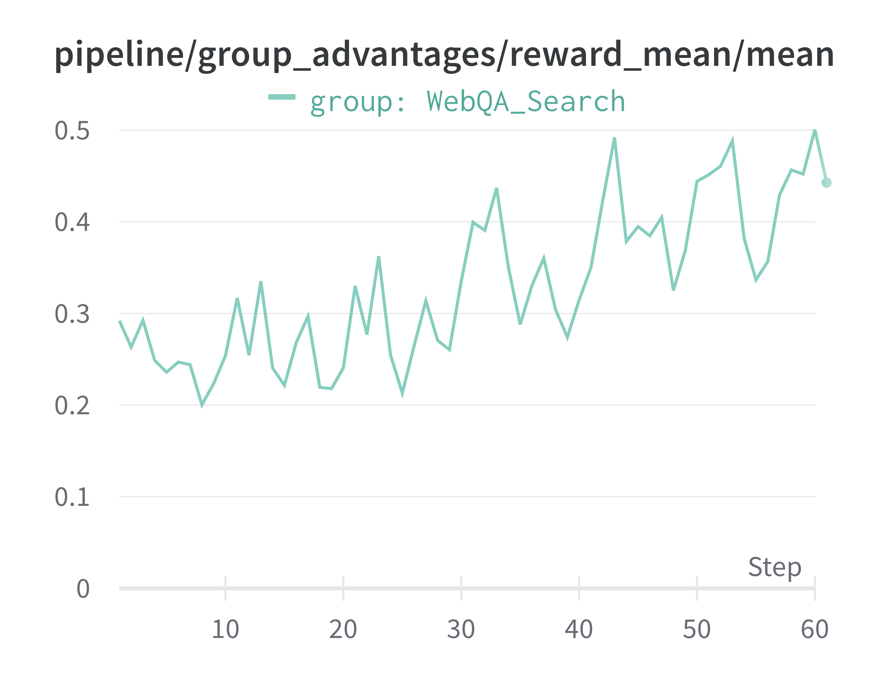
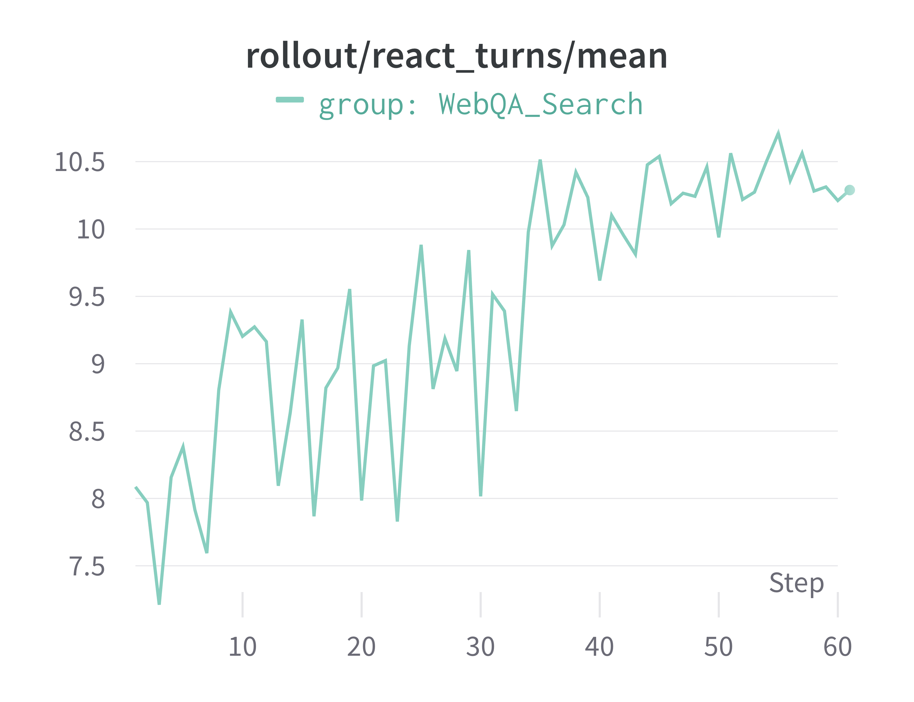

# Example of Training a Multi-Turn Web Search Agent

This example demonstrates how to train a multi-turn web search agent based on the ReAct (Reasoning and Acting) paradigm.
It utilizes the **AgentScope** framework, integrated within the Trinity workflow, to equip an agent with external search tools to find information on the web and answer questions.

We use a subset of the `WebWalkerQA` dataset here. The original dataset can be found at [Hugging Face Datasets](https://huggingface.co/datasets/callanwu/WebWalkerQA).

The config file is located in [`agentscopev1_websearch_agent.yaml`](agentscopev1_websearch_agent.yaml).

## Key Features

*   **Training Multi-Turn ReAct Agent**: The workflow trains a `ReActAgent` from AgentScope that can reason and act in multiple steps.
*   **External Tool Integration**: The agent connects to web search tools via AgentScope's Message-based Communication Protocol (MCP). It supports:
    *   **Tavily Search** (`tavily`)
    *   **SearXNG** (`searxng`)
*   **LLM-based Evaluation**: The agent's final answer is evaluated by an auxiliary "judge" LLM against a ground-truth answer to generate a reward signal for training. It is set by the auxiliary model.
*   **Asynchronous Execution**: The workflow is designed to run asynchronously, improving performance.

## Prerequisites

Before running this workflow, please complete the following setup steps.

1.  **Install Dependencies**

    Install the core AgentScope framework.
    ```bash
    pip install agentscope
    ```
    > **Note**: The required MCP clients (`tavily-mcp` and `mcp-searxng`) will be automatically installed via `npx` on the first run, so no manual installation is needed for them.

2.  **Configure Environment Variables**

    Set the environment variables for the search tool you plan to use.

    *   For **Tavily Search**, set your API key:
      ```bash
      export TAVILY_API_KEY="your_tavily_api_key"
      ```
    *   For **SearXNG**, set the URL of your self-hosted instance:
      ```bash
      export SEARXNG_URL="http://your-searxng-instance.com"
      ```

3.  **Generate the Dataset**

    Run the following script to generate the dataset for evaluation.
    ```bash
    python examples/agentscope_websearch/get_webwalkerQA_data.py
    ```
    *   **(Optional) Filter the Dataset**: For a more focused evaluation, you can filter the dataset by difficulty. For example, you might want to remove samples that cannot be answered even by more capable models, allowing you to benchmark performance on a more consistent set of problems.

## Configuration

All workflow parameters can be configured in the [`agentscopev1_websearch_agent.yaml`](agentscopev1_websearch_agent.yaml) file. Key options under `workflow_args` include:

*   `search_client_type`: The search tool to use. Must be either `"tavily"` or `"searxng"`. If you want to use other search tools, you should make changes in the `trinity/common/workflows/envs/agentscope/agentscopev1_search_workflow.py`.
*   `max_turns`: The maximum number of reasoning/acting steps the agent can take.


## Result
Below we provide the training curve of running using `tavily` search tools.
It takes around 8 hours on 8 H20 GPUs.

Reward curve:


Memory length of ReAct Agent:

