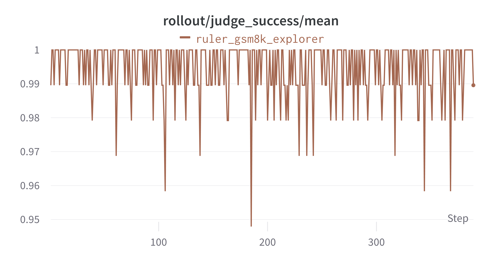

# RL on GSM8K with RULER reward

This example shows a toy implementation of ART's [RULER](https://art.openpipe.ai/fundamentals/ruler) on GSM8k task and GRPO.

RULER (Relative Universal LLM-Elicited Rewards) is a general-purpose reward function that uses an LLM-as-judge to rank the rollouts for a given task.

https://github.com/OpenPipe/ART/blob/main/src/art/rewards/ruler.py


## Configurations and Metrics

The config files are located in [`gsm8k_ruler.yaml`](gsm8k_ruler.yaml) and [`train_gsm8k_ruler.yaml`](train_gsm8k_ruler.yaml).

Some key configs in this example are:
* `default_workflow_type`: set to `math_ruler_workflow`
* `auxiliary_models`: LLM-as-a-judge for RULER; need to set `max_prompt_tokens`, `max_response_tokens`, `max_model_len` appropriately
* `std_threshold` for GRPO advantage: set to small value, filter out group of experiences with same rewards (e.g., when RULER fails to return valid scores, they are set to all zero)
* `sync_style`: use `dynamic_by_explorer`, due to filtering of experiences
* `lr`: set to small value (2e-6) for stability, as rewards can be noisy


Some important metrics to pay attention to are:
* `reward`: reward calculated by RULER
* `gold_reward`: sum of `accuracy_reward` and `format_reward`, rule-based calculation with ground truth (as in original GSM8k example)
* `judge_success`: whether RULER successfully returns a valid score
* `eval_accuracy`: accuracy on the evaluation set


## Results
We show the results below:





Also, an example response from the judge LLM is shown below:
```
Let's evaluate each solution based on its accuracy, logical consistency, and adherence to the format:
1. **Candidate Solution 1**: This solution incorrectly calculates the number of blue candles. It attempts to find the difference between the ratio components rather than using the correct proportional method. The rounding down to a whole number is unnecessary and incorrect.
   - Score: 0.1
2. **Candidate Solution 2**: This solution correctly identifies the steps needed to find the number of blue candles, but the calculation at the end is incorrect. It mistakenly multiplies the number of sets by 3 instead of using the correct method to derive the number of blue candles.
   - Score: 0.4
3. **Candidate Solution 3**: This solution correctly breaks down the problem, calculates the number of groups of 5 red candles, and then uses the ratio to find the number of blue candles. The final answer is correct.
   - Score: 0.9
4. **Candidate Solution 4**: Similar to Solution 3, this solution correctly identifies the steps and performs the calculations accurately, leading to the right answer.
   - Score: 0.9
5. **Candidate Solution 5**: This solution correctly follows the logical steps to find the number of blue candles and arrives at the correct answer. It repeats the answer tag, which isn't ideal but the reasoning and final result are accurate.
   - Score: 0.9
6. **Candidate Solution 6**: This solution provides a clear and accurate explanation of the steps to find the number of blue candles and arrives at the correct answer. It explains the division and multiplication steps well.
   - Score: 1.0
7. **Candidate Solution 7**: This solution misunderstands the ratio application, calculating only 3 groups of 5 red candles, which is incorrect. It results in an incorrect number of blue candles.
   - Score: 0.1
8. **Candidate Solution 8**: This solution correctly applies the ratio and arrives at the right number of blue candles. It succinctly explains the calculation process.
   - Score: 0.9
[0.1, 0.4, 0.9, 0.9, 0.9, 1.0, 0.1, 0.9]
```
