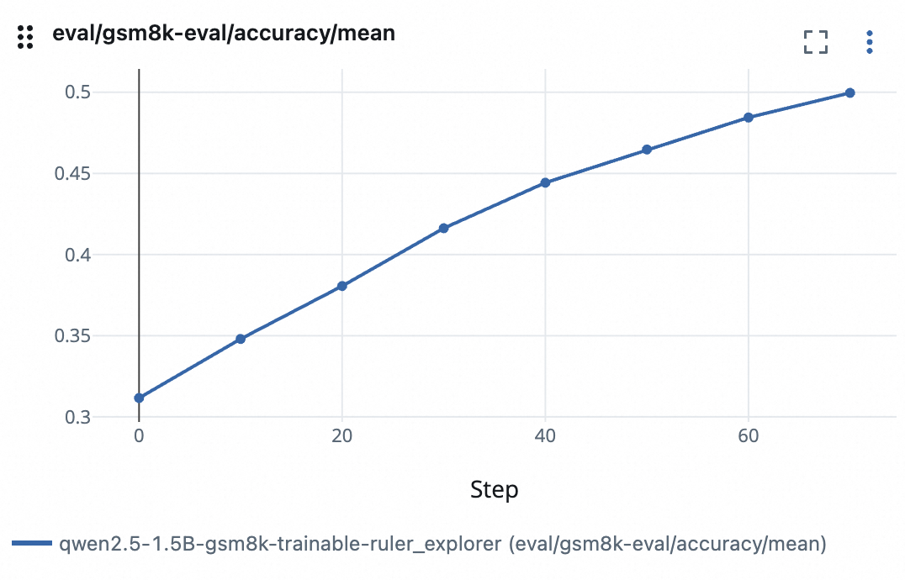

# Policy Model as Its Own Reward Model

Ref: ART's RULER; Kimi-k2.

This example shows an implementation of training a policy model as its own reward model with GRPO, inspired by ART's [RULER](https://art.openpipe.ai/fundamentals/ruler) and KIMI's [K2](https://moonshotai.github.io/Kimi-K2/).

We simulate a scenario where only a fraction (`PROBABILITY_GROUND_TRUTH_AVAILABLE = 0.2`) of tasks have ground-truth answers. We optimize two objectives jointly: one for response generation, the other for RULER-reward generation.

## Configurations and Metrics

The config file is located in [`gsm8k_ruler.yaml`](gsm8k_ruler.yaml).

Some key configs in this example are:

* `default_workflow_type`: set to `math_trainable_ruler_workflow`
* `std_threshold` for GRPO advantage: set to small value, filter out group of experiences with same rewards (e.g., when RULER fails to return valid scores, they are set to all zero)
* `sync_style`: use `dynamic_by_explorer`, due to filtering of experiences
* `train_batch_size`: set to 960; note that one explore step can generate more than 96 * 8 = 768 experiences
* `lr`: set to small value (2e-6) for stability, as rewards can be noisy

Some important metrics to pay attention to are:

* `reward`: reward calculated by rule or by RULER
* `gold_reward`: sum of `accuracy_reward` and `format_reward`, rule-based calculation with ground truth
* `judge_success`: whether RULER successfully returns a valid score (a coarse estimation, mix up two types of experiences)
* `reward_for_judger`: reward for the LLM working as a RULER reward model, calculated by mean absolute error (MAE) distance from gold scores
* `eval_accuracy`: accuracy on the evaluation set (ultimate metric for success of RL)

## Results

We show the results below:

You may compare the above results with [the RULER example](../../examples/grpo_gsm8k_ruler/README.md) with Qwen2.5-32B-Instruct as LLM judge (`auxiliary_models`).

## Potential improvements

As this is a toy example, we may consider some further improvements, such as automatically balancing the number of samples for two objectives, or their loss weights. We also plan to test out this approach in broader scenarios, e.g., cross-domain transfer of the model's critic capability.
