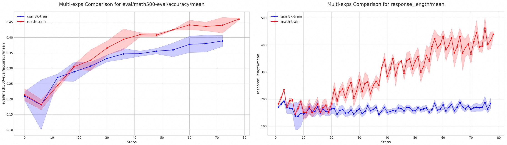

# Multi-Run Experiment Plotting Script

## Description

Due to the stochastic nature of RFT results, multiple experimental runs are necessary to establish reliable average performance and confidence intervals. This script is designed to parse and plot the results from these repeated runs, enabling visual comparisons between different sets of experiments.

## Usage

***Before running this script***, ensure your experiment results are available. For example, after running the [grpo_gsm8k](https://github.com/modelscope/Trinity-RFT/blob/main/examples/grpo_gsm8k/gsm8k.yaml) script **three times**, the result directories will be located under a path pattern such as `/PATH/TO/CHECKPOINT/Trinity-RFT-gsm8k/qwen2.5-1.5B-gsm8k-{1, 2, 3}`. The directory structure for a single run is expected to be as follows:

    └── qwen2.5-1.5B-gsm8k-1
        ├── buffer
        ├── global_step_xxx
        └── monitor
            └── tensorboard
                ├── explorer
                ├── trainer
            └── ...


***To run the script***, you need to configure the following key parameters in `plot_configs.yaml`:

```yaml
plot_configs:
  # A list of all scalar keys to plot
  scalar_keys:
    - "eval/gsm8k-eval/accuracy/mean"
    - "response_length/mean"
    # - "critic/rewards/mean"

exps_configs:
  # Define each experiment group to be plotted
  gsm8k-train:
    # 'paths' should list the root directories of each individual run
    paths:
      - "/PATH/TO/CHECKPOINT/Trinity-RFT-gsm8k/qwen2.5-1.5B-gsm8k-1"
      - "/PATH/TO/CHECKPOINT/Trinity-RFT-gsm8k/qwen2.5-1.5B-gsm8k-2"
      - "/PATH/TO/CHECKPOINT/Trinity-RFT-gsm8k/qwen2.5-1.5B-gsm8k-3"
      # - "/PATH/TO/CHECKPOINT/Trinity-RFT-gsm8k/qwen2.5-1.5B-gsm8k-n"

    # Optional: Color of the curve.
    color: "blue"

  # Define other experiment groups for comparison
  math-train:
    paths:
      - "/PATH/TO/CHECKPOINT/Trinity-RFT-math/qwen2.5-1.5B-math-1"
      # ...
    color: "red"
```


Once the `YAML` file is configured, execute the following command to generate the plot:

```bash
python scripts/multi_exps_plot/multi_exps_plot.py --config scripts/multi_exps_plot/plot_configs.yaml
```

## Example

Below is an example of the output by this script. The experiment shows `Qwen2.5-1.5B-Instruct` RFT with `GRPO` on the `GSM8k` and `MATH` datasets, with performance evaluated on the `MATH500` benchmark.


